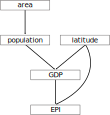

"The 2020 Environmental Performance Index (EPI) provides a data-driven summary of the state of sustainability around the world. Using 32 performance indicators across 11 issue categories, the EPI ranks 180 countries on environmental health and ecosystem vitality. These indicators provide a gauge at a national scale of how close countries are to established environmental policy targets. The EPI offers a scorecard that highlights leaders and laggards in environmental performance and provides practical guidance for countries that aspire to move toward a sustainable future." -- [2020 Environmental Performance Index](https://epi.yale.edu/)


```{r setup, include = FALSE}
knitr::opts_chunk$set(echo = TRUE, message = "hide")
```


# Load libraries
Load used libraries.

```{r, message = FALSE, results = "hide", warning = FALSE}
library("reshape2")
library("ggplot2")
theme_set(theme_bw(base_size = 12) +
            theme(rect = element_rect(fill = "transparent")))
library("leaflet")
library("rgdal")
library("htmlwidgets")
library("lavaan")
library("lavaanPlot")
```


# Read data
## Preparation
Clear the workspace and set working directory.

```{r}
rm(list = ls())
setwd("~/indblik/epi")
```


## Load helper functions
This helper function retrieves, reads and processes the [EPI-](https://epi.yale.edu/downloads) and the [GDP](https://en.wikipedia.org/wiki/Gross_domestic_product) from the [World Bank](https://data.worldbank.org/indicator/NY.GDP.MKTP.CD).

```{r}
source("importEPI.R")
```


## Import data
Run the helper function `importEPI()` and release the contents of the resulting list into the global environment.

```{r, collapse = TRUE}
epi.list <- importEPI()

list2env(epi.list, .GlobalEnv)
rm(epi.list)
```


## Download country borders
Download the shape file with country borders and some affiliated data (area, population etc.) from [thematicmapping](http://thematicmapping.org/), if it is absent. *Note*, this overwrites existing files!

```{r}
if(!file.exists("2020/TM_WORLD_BORDERS-0.3.shp")){
  print("File does not exist, downloading it now:")
  download.file("thematicmapping.org/downloads/TM_WORLD_BORDERS-0.3.zip",
                destfile = "world_shape_file.zip")
  system("unzip -u world_shape_file.zip;
         rm world_shape_file.zip Readme.txt")
  }
```


Then, read this shape file into a `SpatialPolygonsDataFrame` and inspect it.

```{r}
world.spdf <- readOGR(dsn = "2020", layer = "TM_WORLD_BORDERS-0.3",
                      verbose = TRUE)
summary(world.spdf)
```


## Collate countries
Unfortunately, as soon as it comes to map the world, geopolitics come to the fore.
This is reflected in the mismatches between country lists due to the different recognition statuses of these countries.
Luckily, an [ISO standard](https://en.wikipedia.org/wiki/ISO_3166-1_alpha-3) exists that allocates a unique 3-letter code to every country.

For one, there are distinctly more countries in the shape file:

```{r, collapse = TRUE}
length(world.spdf$NAME) 
length(epi$country)
```


These mismatches stem mainly from different naming schemes...

```{r}
sort(setdiff(world.spdf$NAME, epi$country))
```


... but also from the fact that the EPI is missing for some countries.
Countries without an EPI are mostly miniature states (e.g. Monaco, Liechtenstein or Andorra), states currently in a(n) (armed) conflict (Syria, Palestine or Taiwan) or several islands states.
Some of these islands actually belong to a country; e.g., Greenland and Svalbard that belong to Denkmark Norway, respectively. For now, keep it as is although it would be reasonable to merge these islands with their mainlands.

```{r}
sort(setdiff(epi$country, world.spdf$NAME))
```


## Merge datasets
Now, merge the `epi` data.frame and the `world.spdf` SpatialPolygonsDataFrame by the country ISO-3 so that the latter holds all relevant information to render an interactive choropleth map.

```{r}
world.spdf <- merge(world.spdf,
                    epi[, (colnames(epi) %in% c("iso", "EPI.new", "region",
                                                "GDP2019"))], 
                    by.x = "ISO3", by.y = "iso")
names(world.spdf)
```


## Encode population numbers
For readability, population numbers are encoded as millions (M) and for meaningfulness, as numbers instead of characters. 
```{r}
world.spdf@data$POP2005[which(world.spdf@data$POP2005 == 0)] <- NA
world.spdf@data$POP2005 <- as.integer(world.spdf@data$POP2005) / 1000000 %>%
  round(2)
```


# Choropleth map
Now, let's render an interactive map with [R leaflet](https://cran.r-project.org/web/packages/leaflet/index.html) to display the EPI around the globe.


## Color palette
First, create a gradient color scheme for the EPI...

```{r}
epi.cols <- colorNumeric(palette = "viridis", domain = world.spdf@data$EPI.new,
                         na.color = "gray", reverse = TRUE)
```


...and then a discrete color scheme for the regions.
```{r}
region.cols <- colorFactor(palette = "plasma", domain = world.spdf@data$region,
                           na.color = "gray")
```


## Tooltips
Assemble data for tooltips that emerge when hovering over the html-ified map.

```{r}
tooltips <- paste("Country:", world.spdf@data$NAME, "<br/>",
                  "Region:", world.spdf@data$region, "<br/r>",
                  "GDP:", round(world.spdf@data$GDP2019 / 1000000000, 
                                digits = 1), "B US$", "<br/r>",
                  "Population:", round(world.spdf@data$POP2005, 2), "M",
                  "<br/>",
                  "EPI:", world.spdf@data$EPI.new) %>%
  lapply(htmltools::HTML)
```


## Render map
Finally, use the previous steps to generate a leaflet choropleth map.
```{r}
epi.map <- leaflet(world.spdf) %>%
  addTiles() %>%
  setView(lat = 20, lng = 0, zoom = 1.5) %>%
  addPolygons(fillColor = ~ epi.cols(EPI.new), stroke = TRUE, group = "EPI",
              fillOpacity = 0.9, color = "white", weight = 0.5,
              label = tooltips,
              labelOptions = labelOptions(style = list("font-weight" = "normal",
                                                       padding = "3px 8px"),
                                          textsize = "13px", 
                                          direction = "auto")) %>%
  addPolygons(fillColor = ~ region.cols(region), stroke = TRUE,
              group = "Region", fillOpacity = 0.5, color = "white",
              weight = 0.5, label = tooltips,
              labelOptions = labelOptions(style = list("font-weight" = "normal",
                                                       padding = "3px 8px"),
                                          textsize = "13px",
                                          direction = "auto")) %>%
  addLegend(pal = epi.cols, values = ~ EPI.new, opacity = 0.9,
            title = "EPI", position = "topleft", group = "EPI") %>%
  addLegend(pal = region.cols, values = ~ region, opacity = 0.5,
            title = "", position = "topleft", group = "Region") %>%
  addLayersControl(baseGroups = c("EPI", "Region"),
                   options = layersControlOptions(collapsed = FALSE)) %>%
  hideGroup("Region")
epi.map
```


## Export map to html
If needed, export the map to html.

```{r, cache = TRUE}
saveWidget(epi.map, file = "static/leaflet.html")
```


# Analysis
## Color scale for plotting
For consistency, use the same colors for the regions as before in the choropleth map.

```{r}
cols.region <- c("#0D0887", "#5402A3", "#8B0AA5", "#B93289", "#DB5C68",
                 "#F48849", "#FEBC2A", "#F0F921")
```


## National comparison
For an overview of the worldwide distribution of the EPI, the 32 performance indicators are displayed by country in boxplots sorted by their median and colored by region.

```{r, fig.width = 20, fig.height = 7, collapse = TRUE}
ggplot(epi.long[epi.long$Type == "Indicator", ],
       aes(x = reorder(country, EPI.new.value, FUN = median, na.rm = TRUE),
           y = EPI.new.value, fill = region)) +
  geom_boxplot(outlier.shape = 21, outlier.size = 1, alpha = 0.5) +
  scale_fill_manual(values = cols.region) +
  theme(legend.position = "top", legend.title = element_blank(),
        axis.text.x = element_text(angle = 45, hjust = 1),
        axis.text = element_text(size = 5)) +
  ylab("2020 performance indicators") +
  xlab("")
# ggsave("EPI_nations.pdf", width = 20, height = 8.27, bg = "transparent")
```

An ordering according to region is apparent. So, let's have a closer look onto these regions.


## Regional comparison
To highlight the regional differences, the EPIs are pooled by region and displayed in boxplots sorted by their median and colored by region.
That way, the strinking gap between the Global West to the remaining regions becomes apparent.

```{r, collapse = TRUE}
ggplot(epi.long[epi.long$Type == "EPI", ],
       aes(x = reorder(region, EPI.new.value, FUN = median, na.rm = TRUE),
           y = EPI.new.value, fill = region)) +
  geom_boxplot(outlier.shape = 21, outlier.size = 1, alpha = 0.5) +
  scale_fill_manual(values = cols.region) +
  theme(legend.position = "none",
        axis.text.x = element_text(angle = 45, hjust = 1)) +
  ylim(0, 100) +
  ylab("2020 EPI") +
  xlab("")
# ggsave("EPI_regions.pdf", width = 11.29, height = 6.27, bg = "transparent")
```


## EPI vs GDP
There seems to be a distinct relation between the wealth of a country and its EPI.
Plotting the [gross domestic product](https://en.wikipedia.org/wiki/Gross_domestic_product) against the EPI shows that this actually true.
However, this is deceptive as the GDP is on a logarithmic scale.
The correlation is actually only
`r format(round(cor(epi.long[epi.long$Type == "EPI", ]$EPI.new.value, 
      epi.long[epi.long$Type == "EPI", ]$GDP2019, use = "complete.obs"),
      digits = 2), nsmall = 2)`, but increases to
`r round(cor(epi.long[epi.long$Type == "EPI", ]$EPI.new.value, 
      log(epi.long[epi.long$Type == "EPI", ]$GDP2019), use = "complete.obs"), 
      digits = 2)` with the log scaled GDP.

```{r, collapse = TRUE}
ggplot(epi.long[epi.long$Type == "EPI", ],
       aes(x = log(GDP2019 / 1000000), y = EPI.new.value, fill = region)) +
  geom_smooth(aes(group = 1), color = "gray", lty = 2, method = "lm",
              formula = y ~ x, se = FALSE, show.legend = FALSE) +
  geom_point(alpha = 0.5, pch = 21) +
  scale_fill_manual(values = cols.region) +
  theme(legend.position = "top", legend.title = element_blank()) +
  ylim(0, 100) +
  ylab("2020 EPI") +
  xlab(expression(paste(log[e], "(2019 GDP)", " [US$]")))
# ggsave("EPI_GDP.pdf", width = 11.29, height = 6.27, bg = "transparent")
```


# Structural equation model
Now, let's use a [structural equation model (SEM)](https://en.wikipedia.org/wiki/Structural_equation_modeling) to reveal the driving forces behind the EPI.
*Note*, this needs to be considered as a toy model and overinterpretations shall be avoided.

## Merge datasets
Add variables of interest to the `epi` data.frame.

```{r}
epi <- merge(epi,
             world.spdf[, (names(world.spdf) %in% c("ISO3", "AREA",
                                                    "POP2005", "LAT"))],
             by.x = "iso", by.y = "ISO3")
```


## Recode latitude
For a straight-forward comparison, the latitude is reset to 0 at the south pole and 180 at the north pole by adding 90.

```{r}
epi$LAT <- epi$LAT + 90
```


## Scale the variables
For a SEM, the variables need to have a similar variance. Thus, the $z$-scores are calculated to bring the variables on a mean of zero and a standard deviation of one.

```{r}
epi[, c(4, 51:54)] <- apply(epi[, c(4, 51:54)], 2, scale)
summary(epi[, c(4, 51:54)])
```


## Specify the model
The assumption is that the EPI is driven by the GDP, the population size and the latitude with following reasoning:

* the GDP as a measure of economic development is somehow a prerequisite for environmental development
* the latitude represents world's [north-south divide](https://en.wikipedia.org/wiki/North%E2%80%93South_divide_in_the_World)

The GDP, in turn, is influenced by population size due to higher humanpower and latitude due to the north-south divide and the population size by a country's area.


```{r}
epi.gdp <- 'EPI.new ~ GDP2019 + LAT
  GDP2019 ~ LAT + POP2005
  POP2005 ~ AREA'
```

{width=30%}


## Run the model and inspect the results
Running the model with [lavaan](https://lavaan.ugent.be/) reveals a marginal fit for the robust- and none for the standard estimator.

```{r}
fit.epi.gdp <- sem(epi.gdp, data = epi, estimator = "MLM")
summary(fit.epi.gdp, rsq = TRUE)
```


## Inspect modification indices
The modification indices suggest--among others--that also area influences the GDP. This makes sense as a larger country also has the potential to posess more resources. Thus, this path is added to the model, but the model fit remains poor.

```{r, collapse = TRUE}
modificationindices(fit.epi.gdp, minimum.value = 3, op = "~")
fit.epi.gdp.up <- update(fit.epi.gdp, add = "GDP2019 ~ AREA")
summary(fit.epi.gdp.up, rsq = TRUE)
```


## Visualize the model
Finally, the results are plotted as a path diagram including the [path coefficients](https://en.wikipedia.org/wiki/Path_coefficient) and their significance levels.
This path diagram shows, that based on the available data, the strongest direct influence on the EPI is the latitude followed by the GDP. However, only the first is statistically significant.


```{r}
lavaanPlot(model = fit.epi.gdp.up, coefs = TRUE, stars = c("regress"),
           node_options = list(shape = "box", color = "gray",
                               fontname = "Helvetica"),
           edge_options = list(color = "black"),
           labels = list(AREA = "Area", POP2005 = "Population", GDP2019 = "GDP",
                         LAT = "Latitude", EPInew = "EPI"))
```


# Conclusion
Each step added a further insight onto the EPI:

1. The choropleth map showed the distribution of high- and low-valued countries across the globe, whereby a distinct cluster of high-value countries in North America, Europe and Australia/New Zealand was apparent and lowest values were found in East Asia and Africa
1. This finding was supported by the inspection of the EPI by country and region. Especially the regional display revealed a strinking gap between the Global West to the remaining regions.
1. The idea that the GDP drives the EPI seems intuitive: richer countries potentially invest more into a healthy environment. However, the correlation was quite low.
1. The SEM showed that the north-south divide is also reflected in the EPI. Interestingly, the GDP was only the second-most important influence of the EPI. However, this result may likely change when using the [purchasing power parity (PPP)](https://en.wikipedia.org/wiki/Purchasing_power_parity) instead of the GDP, because large countries such as China or Brazil do well regarding the GDP, but perform comparatively poorly regarding the PPP.
Regarding this SEM, however, it is important to keep in mind that the data basis is suboptimal:
First, only available data was selected, even though other aspect would have been interesting.
Second, the data assembly was somehow Frankensteinian with data from multiple years.


# Session info
```{r}
sessionInfo()
```

